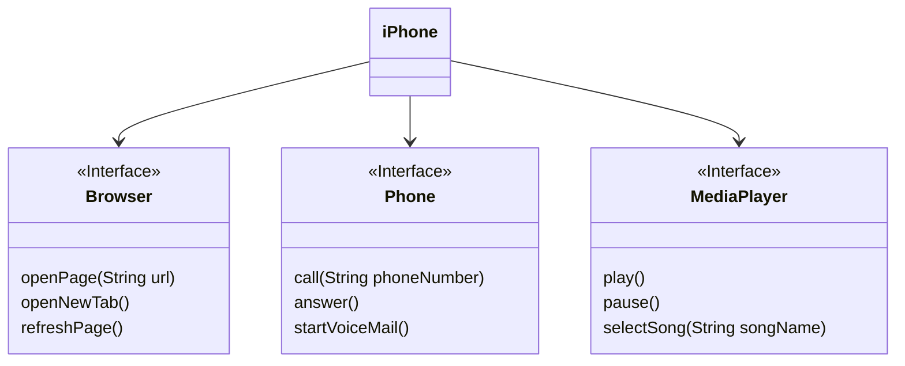

# Modelagem e Diagramação de um Componente iPhone

Modelar e diagramar a representação UML do componente iPhone, abrangendo suas funcionalidades como Reprodutor Musical, Aparelho Telefônico e Navegador na Internet.

## Diagrama UML

